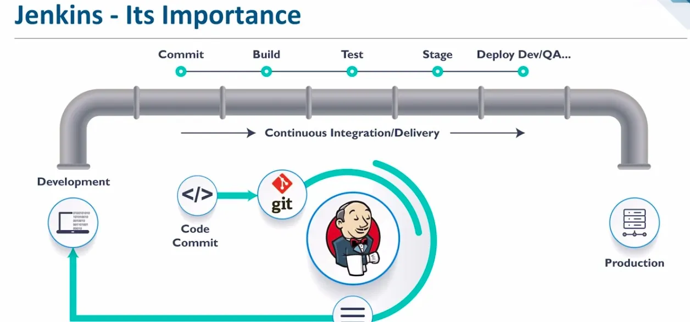
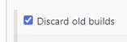
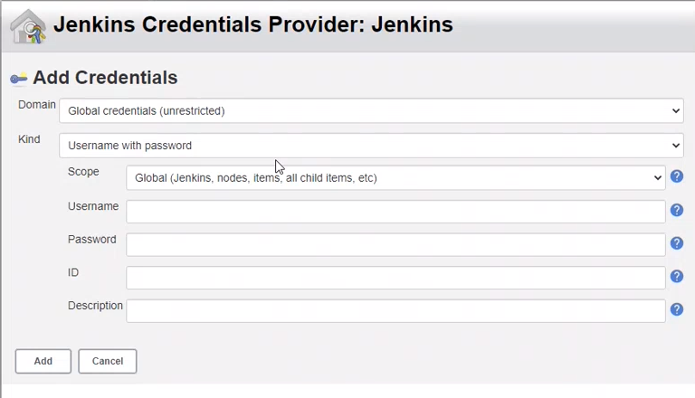

# CICD and Jenkins

## What is CI?
Merging various codes made by the team together into the master branch multiple times a day.

## What is CD?
Continuous delivery is making sure you can release new software or changes made to the customer quickly and sustainably.

## What is Jenkins?
Jenkins is an automation server which is free to use (open source) where the CI process happens.

## Why use Jenkins?
* Out of the other tools available below Jenkins is the only one free to use
* It has the best integration
* Available on most popular operating systems
* Easy installation
* Range of plugins
* Easy environment configuration

## What other tools are available?
* CircleCI
* TeamCity
* Bamboo
* GitLab

## Jenkins stages



* Commit
* Build
* Test
* Stage
* Deploy

## What is the difference between continuous delivery (CD) and continuous deployment (CD)?
* Deployment is completed manually in CD
* There is no human intervention in CDE if there are no errors
* If there are no errors then changes that are made are released straight to the customer and not to production in CDE

## Setting up Jenkins
1. First we need to log into Jenkins using the username and password provided to us by Shahrukh.
2. Next we want to select new item from the dashbaord on the left to create a new item
3. We want to check that we are in the right time zone first
4. We name this item billy-checking-zone
5. Then select ```freestyle project``` and select ok
6. Make a description for this item - ```building a job to check time zone of this server```
7. Select this box below



8. Then enter 3 into max number of builds to keep
9. Scroll down and use the drop down for add build step
10. Select execute shell and type in ```date```
11. Nothing else needs to be changed for now so scroll down and click save
12. On the next page select build now from the dashboard
13. You should now see the below, if it is blue then it has been successful and if it is red then it failed


14. Now to check the time zone select the drop down next to ```#1``` and click on console output
15. At the bottom of the code you can see the date and time
16. To check you are on the right operating system (Ubuntu 18.04 or 20.04) you follow the same steps as above but name this item ```billy-os-check```
17. Create a description to match this
18. Follow all the steps above until you get to ```add build step```
19. This time in the execute shell we want to right ```uname -a``` to give us the operating systen name
20. Click save and then ```build now```
21. Do the same as before by going into the console output and at the bottom of the code you will see what operating system you are on. See example below


## Automating a job in Jenkins
We can automate the checking of the OS by doing the following
1. Go to your checking zone item, use the drop down and select configure
2. Go down to the bottom in the build section and select add post-build section
3. In this drop down select build other projects
4. Then tpye in the name of the os check item - billy-os-check
5. Leave the selection on ```trigger only if build is stable```
6. Then save
7. Click build now
8. Now you will have two parts in your build history
9. Select #2 and click on console output
10. You will see a message that says ```triggering a new build of billy-os-check```
11. Click that link and again use the buld history to check the console output
12. You should now see the operating system

## Linking GitHub to Jenkins to create a CI
1. First we need to generate a new SSH key pair but specifically for the repo that stores our app folder
2. Open a Git Bash terminal and cd into your .ssh location
3. Run the command ```ssh-keygen -t rsa -b 4096 -C billycooke329@gmail.com``` but change the email address to yours
4. You will then be prompted with ```enter a file in which to save the key``` which means what would you like to name it
5. I named it billy-jenkins-key
6. Then click enter twice to skip the passphrase
7. Use ```cat billy-jenkins-key.pub``` to view your public key
8. Copy this and head over to Git Hub
9. Go to the repo that holds your app folder, mine is in sparta_app_deployment
10. Go to settings in this repo and on the left select ```deploy keys```
11. Click add deploy key and name it the same as you named your key on Git Bash
12. Then paste in your public key
13. Now in Jenkins delete your previosuly made items
14. Create a new item called billy-CI and select freestyle project as normal
15. Create a description and follow the normal steps for discard old builds
16. Now select GitHub Project underneath discard old builds
17. You will be promoted to add your project url so go back to GitHub and go into your repo that contains the app folder
18. Select the green button code and copy the HTTPS url
19. Paste this into Jenknis
20. Then in office 365 connector select ```restrict where this project can be run``` and in label expression search for sparta-ubuntu-node which was alrrady made for us
21. Next select Git in source code management
22. We now need to add the SSH url in the repository url section in jenkins


23. Then in credentials select the add drop down and click jenkins
24. This will then pop up



25. Change kind from ```username with password``` to ```SSH username with private key```
26. Enter a username, billy-jenkins
27. Then select enetr directly under private key and click add
28. Go back to your Git Bash terminal and use ```cat billy-jenkins-key``` to reveal your private key
29. Copy this and paste it into the box below


30. Then click add
31. Now back at credentials search for your username that you just made and select that
32. Change the branch to main
33. Scroll down to build environment and select ```provide node & npm bin/ foler to PATH```
34. Then go down to add buld step, select execute shell and enter the command below


35. Then click save and build now
36. This will take slightly linger than before but you should see as normal  in build history that it was successful
37. In AWS this will have created multiple instances