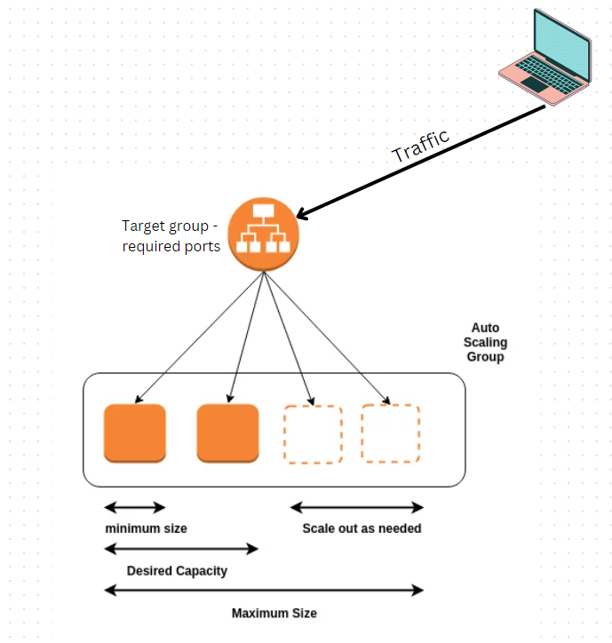
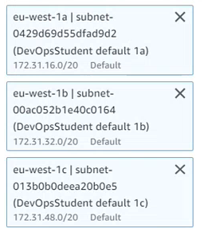

# Load balancer and autoscaling

## What is a load balancer?

A load balancer is a device that receives traffic from the internet and sends it to the instances. If the instances are broken it will stop the traffic and divert it to a working instance nearby. It will then wait for the instance to be fixed or a new one made before redirecting the traffic back to it.

## What is autoscaling?

An autoscaling group has the job of dealing with the broken instances. Whilst the load balancer stops the tarffic the autoscaling group terminates the instance and replaces it with a new one. Once the new instance is ready to go the autoscaling group sends a message to the load balancer to say it can now redirect the traffic back.

## What is a target group?
The target group tells the laod balancer where to direct traffic depending on what port they are on.

## Load balancer and autoscaling diagram



In the diagram above:
1. The traffic comes in from users and passes through the load balancer
2. The load balancer is set with a target group of certain ports that canuse this
3. If there are no issues then the traffic passes onto the instances as normal
4. If there are any problmes with the instances such as if one is broke then the load balancer will stop the traffic and redirect it to a nearby instance.
5. Then the autoscaling group automatically starts to launch a new instance and terminates the old one.
6. Once the new instance is up and running and load balancer will direct the traffic back to it.
7. The diagram also shows that we are not always running at maximum capacity and autoscaling helps us with that
8. We can set rules for the autoscaling groups for example to say if CPU utilization goes above 50% then more instances are need or if it drops below a certain percentage then to terminate some instances
9. The autoscaling group will monitor this and will automatically launch or terminate instances to scale to the utilization

## Benefits of this
* Instances are not overloaded with traffic
* If there are errors in an instance then the software can still run
* Reduced costs
* Less downtime

## Creating a load balancer and autoscaling group

1. Go to AWS and use the dashboard to go into launch template
2. Click create launch template and name it
3. Add a description and tick this box


4. The scroll down and select your AMI. We sued 18.08 Ubuntu
5. Next select the key pair ```tech221```
6. Select your security group or create a new one
7. Go into advanced details and enter in the below in user data


8. Then select create launch template
9. Next we need to create an autoscaling group so sue the dashboard to navigate to auto scaling groups
10. Select create auto scaling group and name it
11. Now we want to select the launch template we just made and click next
12. Select a VPC or leave it as default. We left it as default
13. Then we want to select our subnets
14. These three were already made for us



15. Click next
16. Select attach to a new load balancer as we want to make a new one
17. Then select application load balancer as we want it to have access to the internet
18. Then select internet facing
19. Scroll down to the ports section and click into default routing
20. Select create a target table
21. Turn on elastic laod balancing health checks and click next
22. Change the desired capacity and minimum capacity to 2
23. Change maximum capacity to 3
24. In scaling policies select target tarcking scaling policy
25. Select next and then again select next
26. In tags we want to enter name in keys and then the name of the tag in value
27. Select next, review everything and then create auto scaling group
28. Now go to your instances and you should see that you have two running or 3 if your CPU utilization has triggered a third one to be made
29. You can use the public IP address of each instance to check they are working by pasting them into separate browsers